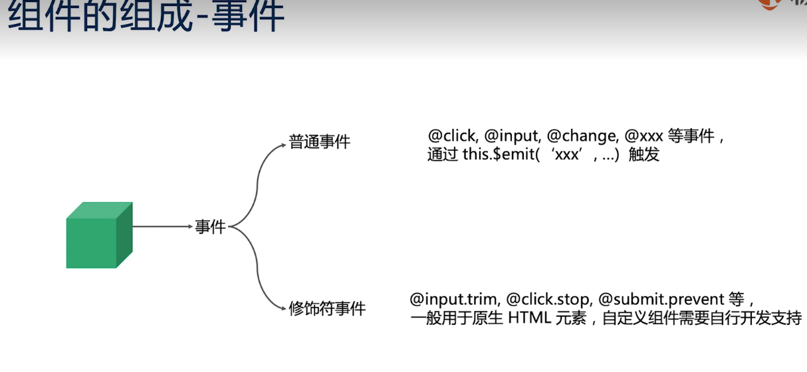
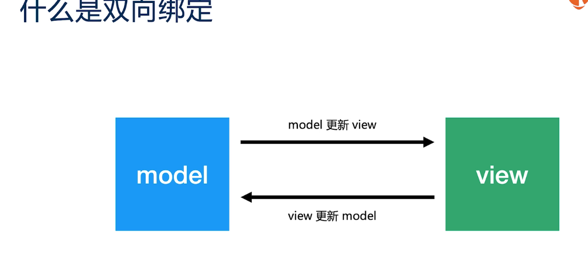

### 事件和属性
vue的三大核心概念分别是：属性，事件，插槽



我们通过一个例子来看父子组件的事件和属性
```vue
<!-- 父组件 -->
<template>
  <!--使用栅格系统做布局 -->
  <div class="container">
      <addblacklist :visible="showlist" @create="hidelist" @cancel="hidelist"></addblacklist>
      <!-- 父组件中调用的子组件  属性visible接收参数showlist，监听两个事件creat和cancel -->
  </div>
</template>

<script>
import Axios from 'axios';
import addblacklist from "@/components/blacklistManage/addBlacklist";
export default {
  components: { addblacklist,  },
  data() {
    return {
      showlist: false,
    };
  },
  methods: {
    showblacklist() {
      this.showlist = true;
    },
    hidelist() {
      this.showlist = false;
    },
</script>

<style>
.space {
  margin-top: 10px;
}
</style>
```
```vue
<!-- 子组件 addblacklist-->
<template>
  <div>
    <a-modal
      :visible="visible"
      title="新增/修改人员信息"
      okText="确定"
      cancelText="取消"
      width="900px"
      :destroyOnClose="true"
      @cancel="()=>{$emit('cancel')}"
      @ok="()=>{$emit('create')}"
    >
    <!-- 子组件的的自定义事件OK点击之后会通过$emit触发create事件，父组件调用的子组件监听到这个事件，运行绑定的函数，修改值 -->
    </a-modal>
  </div>
</template>

<script>
import axios from "axios";
export default {
  props: ["visible",],
  <!-- 子组件接收的参数 -->
  data() {
    return {};
  },
};
</script>

<style scoped>
</style>

```
在这个实例中，我们会发现，子组件的显示与否是通过一个Boolean来控制的。但是子组件并没有修改这个属性，而是通过$emit来出发监听的事件，让父组件修改这个值。

### 单向数据流
v-model一直被称为双向绑定，什么是双向绑定



model 和view的更新能相互出发对方的更新

实际上：


```
Object.defineProperty这个API只是响应式更新，并不是双向绑定；
vue是单项数据流，不是双向绑定；
语法糖：
<personalInfo
v-model="phoneInfo"
:zip-code.sync="zipCode"
/>
<personalInfo
:phone-info="phoneInfo"
@change="val =>(phoneInfo=val)"
<!-- props -->
<!-- event -->
:zip-code="zipCode"
@update:zipCode-="val =>(zipCode =val)"
/>
```

props down,event up

